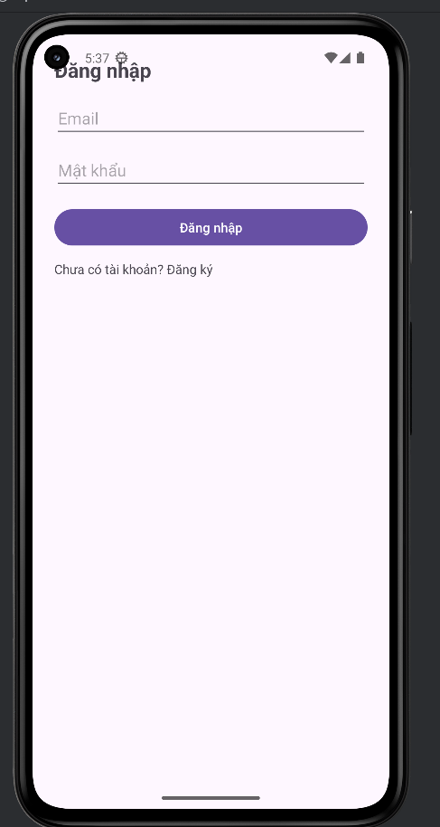
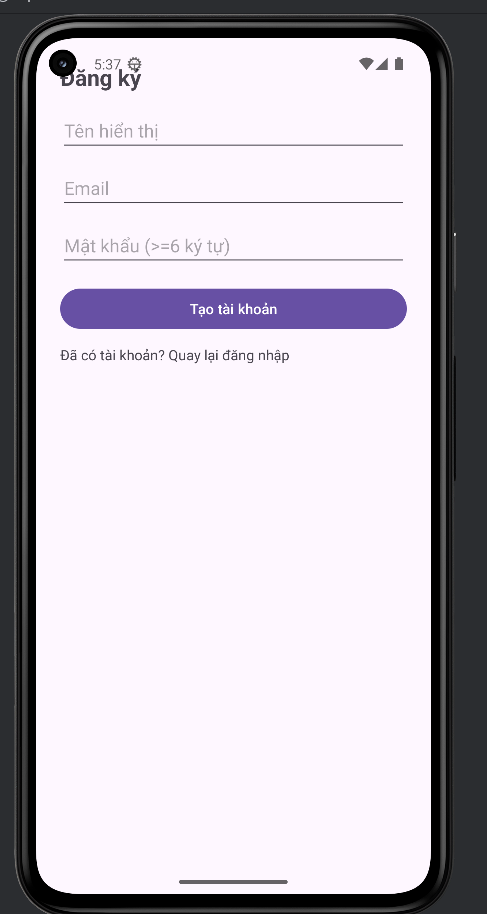
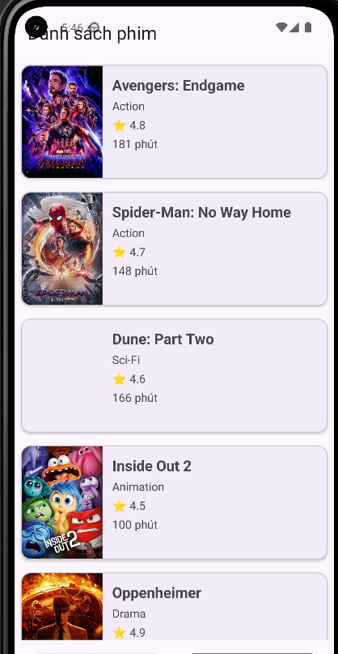
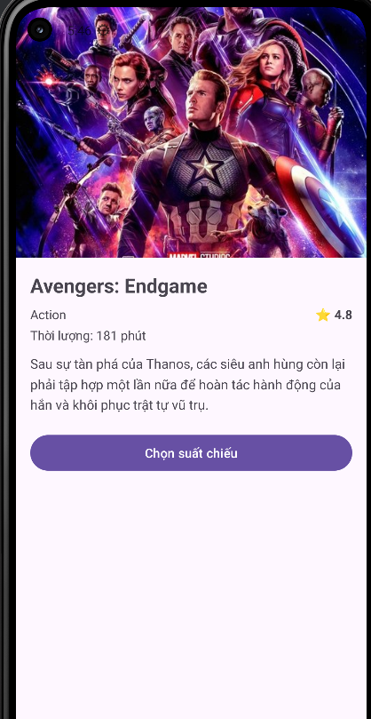
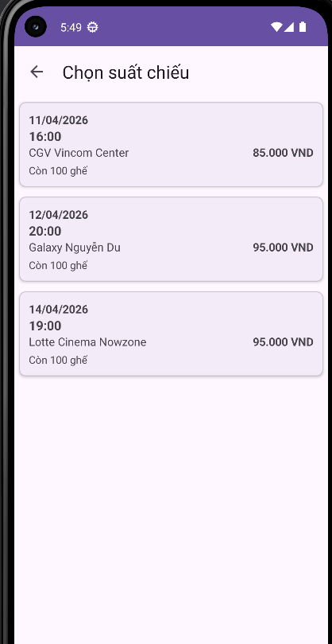
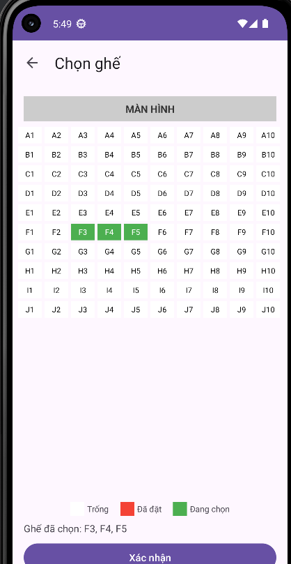
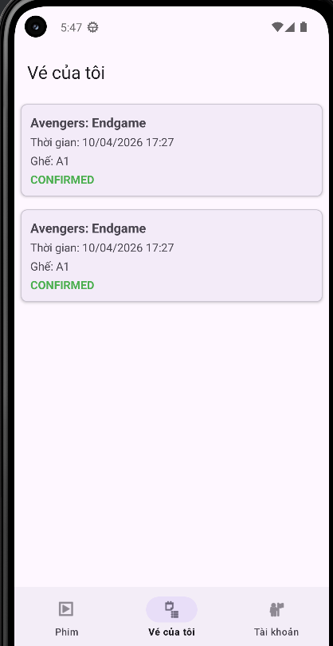
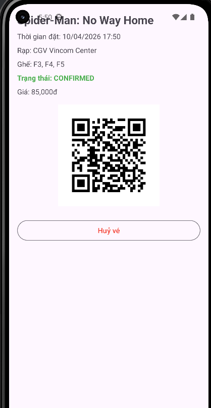
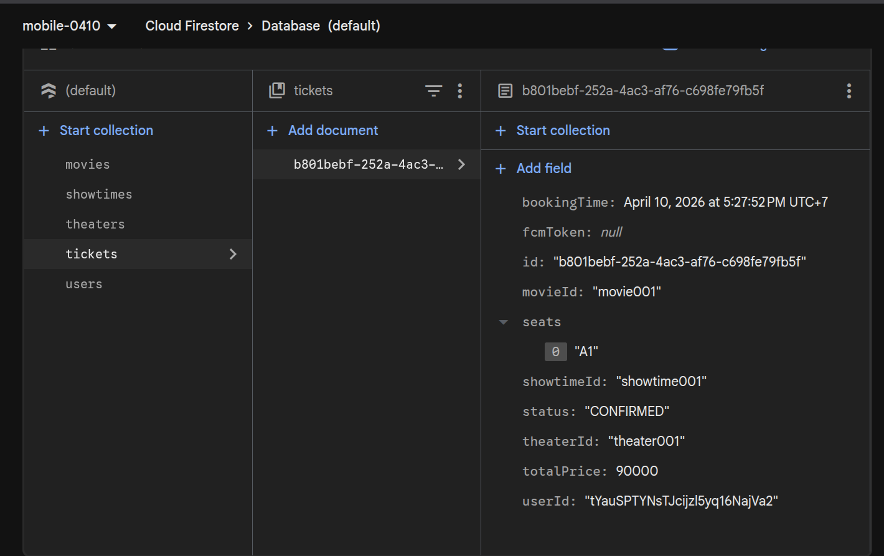
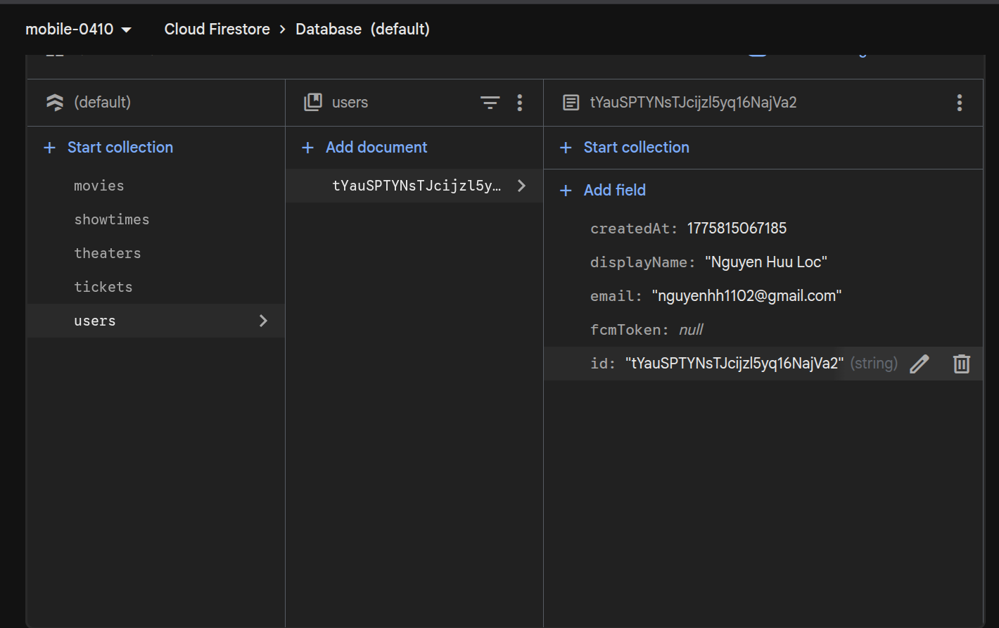

# 🎬 Mobile_0410 - Ứng dụng Đặt Vé Xem Phim

Ứng dụng Android đặt vé xem phim trực tuyến, được xây dựng bằng **Java** với **Firebase** (Authentication, Firestore, Cloud Messaging). Người dùng có thể đăng ký/đăng nhập tài khoản, xem danh sách phim đang chiếu, chọn suất chiếu & ghế ngồi, đặt vé và nhận thông báo nhắc nhở trước giờ chiếu.

---

## 📋 Mục lục

- [Công nghệ sử dụng](#-công-nghệ-sử-dụng)
- [Chức năng chi tiết](#-chức-năng-chi-tiết)
  - [1. Đăng nhập](#1-đăng-nhập-login)
  - [2. Đăng ký](#2-đăng-ký-register)
  - [3. Danh sách phim](#3-danh-sách-phim)
  - [4. Chi tiết phim](#4-chi-tiết-phim)
  - [5. Chọn suất chiếu](#5-chọn-suất-chiếu)
  - [6. Chọn ghế ngồi](#6-chọn-ghế-ngồi)
  - [7. Vé của tôi](#7-vé-của-tôi)
  - [8. Chi tiết vé](#8-chi-tiết-vé)
- [Cơ sở dữ liệu Firestore](#-cơ-sở-dữ-liệu-firestore)
- [Cấu trúc dự án](#-cấu-trúc-dự-án)
- [Hướng dẫn cài đặt](#-hướng-dẫn-cài-đặt)

---

## 🛠 Công nghệ sử dụng

| Công nghệ | Mô tả |
|---|---|
| **Java 11** | Ngôn ngữ lập trình chính |
| **Android SDK 36** | Target SDK mới nhất |
| **Firebase Auth** | Xác thực người dùng (Email/Password) |
| **Firebase Firestore** | Cơ sở dữ liệu NoSQL realtime |
| **Firebase Cloud Messaging** | Push notification |
| **WorkManager** | Lên lịch nhắc nhở trước giờ chiếu |
| **Glide** | Tải và hiển thị hình ảnh phim |
| **ZXing** | Tạo mã QR cho vé điện tử |
| **Material Design** | Giao diện Material UI |

---

## 🎯 Chức năng chi tiết

### 1. Đăng nhập (Login)



**Mô tả:** Màn hình đăng nhập cho phép người dùng truy cập vào ứng dụng bằng tài khoản đã đăng ký.

**Các thành phần giao diện:**
- **Tiêu đề:** "Đăng nhập" hiển thị ở đầu màn hình
- **Trường Email:** Nhập địa chỉ email đã đăng ký
- **Trường Mật khẩu:** Nhập mật khẩu tài khoản
- **Nút "Đăng nhập":** Nút bấm màu tím, xử lý xác thực qua Firebase Authentication
- **Liên kết "Chưa có tài khoản? Đăng ký":** Điều hướng sang màn hình đăng ký

**Luồng xử lý:**
1. Người dùng nhập email và mật khẩu
2. Kiểm tra dữ liệu đầu vào (không được để trống)
3. Gọi `FirebaseAuth.signInWithEmailAndPassword()` để xác thực
4. Nếu thành công → chuyển đến màn hình danh sách phim (`MoviesActivity`)
5. Nếu thất bại → hiển thị thông báo lỗi từ Firebase

---

### 2. Đăng ký (Register)



**Mô tả:** Màn hình đăng ký cho phép người dùng mới tạo tài khoản để sử dụng ứng dụng.

**Các thành phần giao diện:**
- **Tiêu đề:** "Đăng ký" hiển thị ở đầu màn hình
- **Trường Tên hiển thị:** Nhập tên hiển thị của người dùng
- **Trường Email:** Nhập địa chỉ email
- **Trường Mật khẩu:** Nhập mật khẩu (yêu cầu tối thiểu 6 ký tự, hiển thị placeholder "Mật khẩu (>=6 ký tự)")
- **Nút "Tạo tài khoản":** Nút bấm màu tím, xử lý đăng ký tài khoản
- **Liên kết "Đã có tài khoản? Quay lại đăng nhập":** Quay về màn hình đăng nhập

**Luồng xử lý:**
1. Người dùng nhập đầy đủ: Tên hiển thị, Email, Mật khẩu
2. Validate dữ liệu:
   - Không được để trống bất kỳ trường nào
   - Mật khẩu phải >= 6 ký tự
3. Gọi `FirebaseAuth.createUserWithEmailAndPassword()` để tạo tài khoản
4. Sau khi tạo thành công, lưu thêm thông tin người dùng (`AppUser`) vào Firestore collection `users`
5. Hiển thị thông báo "Đăng ký thành công. Hãy đăng nhập." và quay lại màn hình đăng nhập

---

### 3. Danh sách phim



**Mô tả:** Màn hình chính sau khi đăng nhập, hiển thị danh sách các phim đang chiếu dưới dạng danh sách dọc với đầy đủ thông tin.

**Các thành phần giao diện:**
- **Tiêu đề:** "Danh sách phim" hiển thị ở đầu màn hình
- **RecyclerView:** Hiển thị danh sách phim đang chiếu, mỗi item bao gồm:
  - **Poster phim:** Hình ảnh poster hiển thị bên trái
  - **Tên phim:** Tiêu đề phim (VD: "Avengers: Endgame", "Spider-Man: No Way Home", "Dune: Part Two", "Inside Out 2", "Oppenheimer")
  - **Thể loại:** Thể loại phim (Action, Sci-Fi, Animation, Drama)
  - **Đánh giá:** Điểm đánh giá kèm icon ngôi sao (⭐ 4.8, 4.7, 4.6, ...)
  - **Thời lượng:** Độ dài phim tính bằng phút (181 phút, 148 phút, ...)
- **Bottom Navigation Bar** với 3 tab: Phim, Vé của tôi, Tài khoản

**Luồng xử lý:**
1. Truy vấn Firestore collection `movies` với điều kiện `isNowShowing = true`
2. Hiển thị danh sách phim dạng danh sách dọc với poster, tên, thể loại, điểm đánh giá và thời lượng
3. Nhấn vào phim → chuyển đến màn hình chi tiết phim

---

### 4. Chi tiết phim



**Mô tả:** Hiển thị thông tin chi tiết của một bộ phim với poster lớn và nút chọn suất chiếu.

**Các thành phần giao diện:**
- **Poster lớn:** Hình ảnh poster phim chiếm phần trên của màn hình
- **Tên phim:** Hiển thị nổi bật (VD: "Avengers: Endgame")
- **Thể loại:** Thể loại phim (VD: "Action")
- **Đánh giá:** Điểm đánh giá kèm icon ngôi sao (⭐ 4.8)
- **Thời lượng:** Hiển thị dạng "Thời lượng: 181 phút"
- **Mô tả phim:** Nội dung tóm tắt của phim
- **Nút "Chọn suất chiếu":** Nút bấm màu tím, chuyển đến màn hình chọn suất chiếu

**Luồng xử lý:**
1. Tải thông tin phim từ Firestore theo `movieId`
2. Hiển thị đầy đủ poster, tên, thể loại, đánh giá, thời lượng và mô tả
3. Nhấn nút "Chọn suất chiếu" → chuyển đến màn hình chọn suất chiếu

---

### 5. Chọn suất chiếu



**Mô tả:** Màn hình hiển thị danh sách các suất chiếu còn trống cho phim đã chọn, bao gồm thông tin ngày giờ, rạp chiếu và giá vé.

**Các thành phần giao diện:**
- **Toolbar** với nút quay lại (←) và tiêu đề "Chọn suất chiếu"
- **Danh sách suất chiếu** (RecyclerView), mỗi item bao gồm:
  - **Ngày chiếu:** Ngày tháng năm (VD: "11/04/2026", "12/04/2026", "14/04/2026")
  - **Giờ chiếu:** Giờ bắt đầu (VD: "16:00", "20:00", "19:00")
  - **Tên rạp:** Tên rạp chiếu phim (VD: "CGV Vincom Center", "Galaxy Nguyễn Du", "Lotte Cinema Nowzone")
  - **Số ghế còn trống:** Hiển thị số ghế khả dụng (VD: "Còn 100 ghế")
  - **Giá vé:** Hiển thị giá vé bằng VNĐ (VD: "85.000 VND", "95.000 VND")

**Luồng xử lý:**
1. Tải danh sách suất chiếu (`showtimes`) liên kết với phim từ Firestore
2. Sắp xếp suất chiếu theo `startTime` tăng dần
3. Hiển thị thông tin ngày, giờ, rạp, số ghế trống và giá vé
4. Nhấn vào suất chiếu → chuyển đến màn hình chọn ghế

---

### 6. Chọn ghế ngồi



**Mô tả:** Giao diện sơ đồ ghế ngồi dạng lưới, cho phép người dùng chọn ghế mong muốn với cập nhật realtime.

**Các thành phần giao diện:**
- **Toolbar** với nút quay lại (←) và tiêu đề "Chọn ghế"
- **Thanh "MÀN HÌNH":** Biểu thị vị trí màn chiếu phía trên sơ đồ ghế
- **GridView 10 cột:** Hiển thị 100 ghế (A1 → J10), mỗi ghế một ô
  - ⬜ **Màu trắng/xám:** Ghế còn trống (có thể chọn)
  - 🟥 **Màu đỏ:** Ghế đã được đặt (không thể chọn)
  - 🟩 **Màu xanh lá:** Ghế đang được chọn bởi người dùng hiện tại
- **Chú thích màu sắc:** Hiển thị ở cuối gồm: Trống, Đã đặt, Đang chọn
- **Danh sách ghế đã chọn:** Hiển thị text "Ghế đã chọn: F3, F4, F5"
- **Nút "Xác nhận":** Nút bấm màu tím, chuyển sang màn hình xác nhận đặt vé

**Tính năng nổi bật:**
- **Realtime Sync:** Lắng nghe thay đổi `seatMap` từ Firestore bằng `addSnapshotListener()` → ghế được đặt bởi người khác sẽ tự động cập nhật đỏ
- **Giới hạn:** Tối đa 5 ghế mỗi lần đặt
- **Conflict handling:** Nếu ghế đang chọn bị người khác đặt, tự động bỏ chọn

---

### 7. Vé của tôi



**Mô tả:** Hiển thị danh sách tất cả vé mà người dùng đã đặt, truy cập qua tab "Vé của tôi" trên Bottom Navigation.

**Các thành phần giao diện:**
- **Tiêu đề:** "Vé của tôi"
- **RecyclerView:** Danh sách vé, mỗi item bao gồm:
  - **Tên phim:** Tên phim đã đặt (VD: "Avengers: Endgame")
  - **Thời gian:** Thời gian đặt vé (VD: "Thời gian: 10/04/2026 17:27")
  - **Ghế:** Danh sách ghế đã đặt (VD: "Ghế: A1")
  - **Trạng thái:** Trạng thái vé hiển thị màu xanh lá (VD: "CONFIRMED")
- **Bottom Navigation Bar** với 3 tab: Phim, Vé của tôi, Tài khoản

**Luồng xử lý:**
1. Truy vấn Firestore `tickets` theo `userId` của user đang đăng nhập
2. Với mỗi vé, tải thêm tên phim từ collection `movies`
3. Hiển thị danh sách vé kèm tên phim, thời gian, ghế và trạng thái
4. Nhấn vào vé → Xem chi tiết vé (bao gồm mã QR)

---

### 8. Chi tiết vé



**Mô tả:** Hiển thị thông tin chi tiết của một vé đã đặt, bao gồm mã QR để xuất trình tại rạp và chức năng huỷ vé.

**Các thành phần giao diện:**
- **Tên phim:** Hiển thị nổi bật ở đầu (VD: "Spider-Man: No Way Home")
- **Thời gian đặt:** Ngày giờ đặt vé (VD: "Thời gian đặt: 10/04/2026 17:50")
- **Rạp chiếu:** Tên rạp (VD: "Rạp: CGV Vincom Center")
- **Ghế:** Danh sách ghế đã đặt (VD: "Ghế: F3, F4, F5")
- **Trạng thái:** Trạng thái vé hiển thị màu xanh lá (VD: "Trạng thái: CONFIRMED")
- **Giá:** Tổng giá vé (VD: "Giá: 85,000đ")
- **Mã QR:** Mã QR được tạo bởi thư viện ZXing, chứa thông tin vé để xuất trình tại rạp
- **Nút "Huỷ vé":** Nút cho phép người dùng huỷ vé đã đặt

**Luồng xử lý:**
1. Tải thông tin chi tiết vé từ Firestore theo `ticketId`
2. Tạo mã QR bằng thư viện ZXing chứa thông tin vé
3. Hiển thị đầy đủ thông tin vé và mã QR
4. Nhấn "Huỷ vé" → cập nhật trạng thái vé trong Firestore

---

## 💾 Cơ sở dữ liệu Firestore

### Cấu trúc Collections



**Mô tả:** Ứng dụng sử dụng Firebase Cloud Firestore với 5 collections chính:

| Collection | Mô tả |
|---|---|
| **movies** | Lưu trữ thông tin phim (tên, thể loại, poster, đánh giá, thời lượng, mô tả) |
| **showtimes** | Lưu trữ suất chiếu (ngày giờ, rạp, giá vé, số ghế trống, seatMap) |
| **theaters** | Lưu trữ thông tin rạp chiếu (tên, địa chỉ) |
| **tickets** | Lưu trữ thông tin vé đã đặt (movieId, showtimeId, theaterId, userId, seats, totalPrice, status, bookingTime) |
| **users** | Lưu trữ thông tin người dùng (displayName, email, fcmToken, createdAt) |

### Cấu trúc document Ticket

```
tickets/{ticketId}
├── bookingTime: Timestamp     // Thời gian đặt vé
├── fcmToken: string | null    // Token FCM cho push notification
├── id: string                 // ID của vé
├── movieId: string            // ID phim (VD: "movie001")
├── seats: array               // Danh sách ghế (VD: ["A1"])
├── showtimeId: string         // ID suất chiếu (VD: "showtime001")
├── status: string             // Trạng thái (VD: "CONFIRMED")
├── theaterId: string          // ID rạp (VD: "theater001")
├── totalPrice: number         // Tổng giá (VD: 90000)
└── userId: string             // ID người dùng
```

### Cấu trúc document User



```
users/{userId}
├── createdAt: number          // Thời gian tạo tài khoản (timestamp)
├── displayName: string        // Tên hiển thị (VD: "Nguyen Huu Loc")
├── email: string              // Email (VD: "nguyenhh1102@gmail.com")
├── fcmToken: string | null    // Token FCM cho push notification
└── id: string                 // ID người dùng
```

---

## 🔔 Thông báo nhắc nhở

**Mô tả:** Hệ thống thông báo tự động nhắc nhở người dùng trước giờ chiếu phim.

**Các thành phần:**
- **ShowtimeReminderWorker:** WorkManager Worker, gửi notification local nhắc nhở trước giờ chiếu 1 tiếng
- **AppFirebaseMessagingService:** Nhận push notification từ Firebase Cloud Messaging
- **NotificationHelper:** Hiển thị notification trên thiết bị
- **FCM Token:** Tự động lưu token FCM vào Firestore khi token được cấp mới

---

## 📁 Cấu trúc dự án

```
app/src/main/java/com/hocnv/mobile_0410/
├── auth/                          # Module xác thực
│   ├── LoginActivity.java         # Màn hình đăng nhập
│   └── RegisterActivity.java      # Màn hình đăng ký
├── home/                          # Module trang chủ
│   └── HomeFragment.java          # Fragment danh sách phim đang chiếu
├── movies/                        # Module phim
│   ├── MoviesActivity.java        # Danh sách phim
│   ├── MovieDetailActivity.java   # Chi tiết phim & suất chiếu
│   ├── MovieAdapter.java          # Adapter RecyclerView phim
│   ├── BookTicketActivity.java    # Đặt vé xem phim
│   └── ShowtimeAdapter.java       # Adapter RecyclerView suất chiếu
├── booking/                       # Module đặt vé
│   ├── SeatSelectionActivity.java # Chọn ghế ngồi (realtime)
│   ├── ShowtimeActivity.java      # Chọn suất chiếu
│   ├── BookingConfirmActivity.java# Xác nhận & thanh toán
│   └── BookingSuccessActivity.java# Đặt vé thành công
├── tickets/                       # Module vé
│   ├── MyTicketsFragment.java     # Danh sách vé của tôi
│   └── TicketAdapter.java         # Adapter RecyclerView vé
├── notifications/                 # Module thông báo
│   ├── AppFirebaseMessagingService.java  # Nhận push notification
│   ├── NotificationHelper.java    # Helper hiển thị notification
│   └── ShowtimeReminderWorker.java# Worker nhắc nhở giờ chiếu
├── data/                          # Tầng dữ liệu
│   ├── FirestoreRefs.java         # Tên các collection Firestore
│   └── models/                    # Data models
│       ├── AppUser.java           # Model người dùng
│       ├── Movie.java             # Model phim
│       ├── Showtime.java          # Model suất chiếu
│       ├── Theater.java           # Model rạp chiếu
│       └── Ticket.java            # Model vé
├── seed/                          # Module seed data (dev/test)
├── profile/                       # Module hồ sơ cá nhân
├── util/                          # Tiện ích
├── MainActivity.java              # Activity chính (Bottom Navigation)
└── SplashActivity.java            # Splash screen
```

---

## 🚀 Hướng dẫn cài đặt

### Yêu cầu
- Android Studio Ladybug trở lên
- JDK 11+
- Tài khoản Firebase

### Các bước

1. **Clone dự án**
   ```bash
   git clone <repository-url>
   ```

2. **Cấu hình Firebase**
   - Tạo project Firebase tại [Firebase Console](https://console.firebase.google.com/)
   - Bật **Authentication** → Email/Password
   - Tạo **Firestore Database**
   - Bật **Cloud Messaging**
   - Tải file `google-services.json` và đặt vào thư mục `app/`

3. **Build & Run**
   ```bash
   ./gradlew assembleDebug
   ```
   Hoặc mở bằng Android Studio và nhấn **Run ▶️**

---

## 👨‍💻 Tác giả

- **HocNV** - *Nguyễn Văn Hoc*

---

> **Ghi chú:** Ứng dụng sử dụng Firebase Firestore Transaction để đảm bảo tính nhất quán khi nhiều người dùng cùng đặt vé cho một suất chiếu, tránh xung đột ghế ngồi (race condition).
